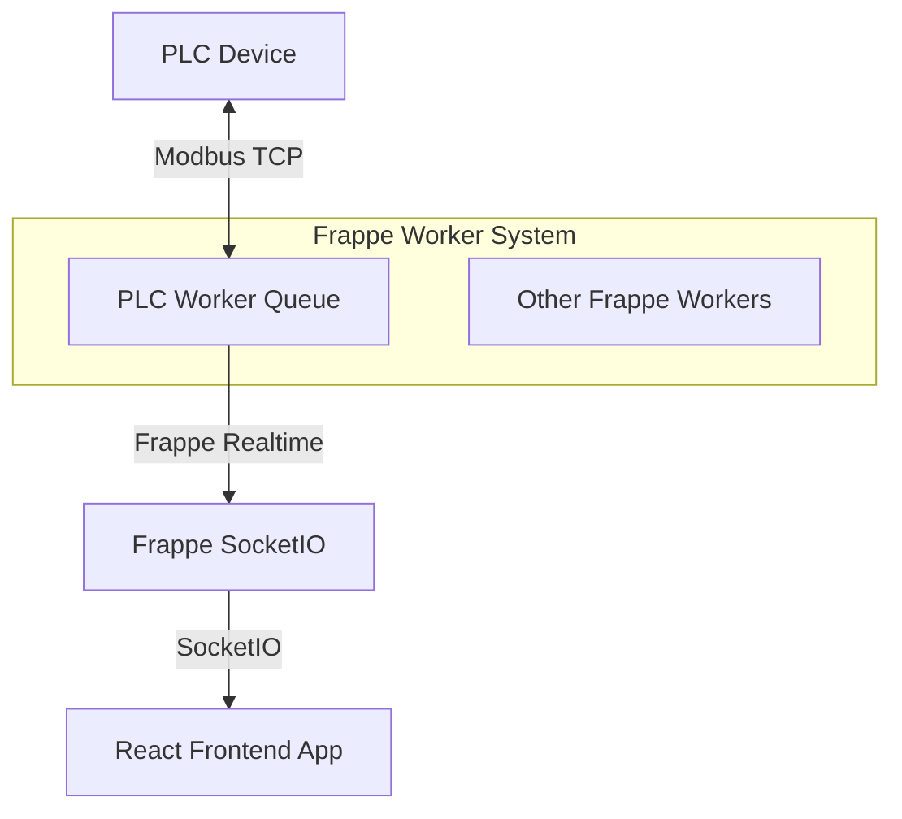

# PLC Bridge Integration Plan

This document outlines the plan for integrating the PLC bridge into Frappe's worker architecture as part of the EpiBus app.

## Current Architecture

- **PLC Bridge**: Standalone Python process communicating with PLC via Modbus TCP
- **PLCRedisClient**: Frappe module communicating with PLC bridge via Redis
- **Redis to SocketIO Bridge**: Standalone process forwarding Redis messages to Socket.IO
- **Frontend React App**: Uses Frappe's realtime system via `useSignalMonitor` hook

## Issues

- Multiple communication layers (Redis, standalone SocketIO, Frappe's realtime)
- Standalone process outside Frappe's worker system
- No built-in monitoring or automatic restart capabilities
- Redundant communication paths

## New Architecture



## Implementation Steps

### 1. Create Custom Worker Queue Configuration

Add to `sites/common_site_config.json`:

```json
{
  "workers": {
    "plc": {
      "timeout": 300,
      "workers": 1
    }
  }
}
```

### 2. Create PLC Worker Module

Create `apps/epibus/epibus/utils/plc_worker.py`:

```python
import frappe
import time
import json
from pymodbus.client import ModbusTcpClient
from dataclasses import dataclass
from typing import Dict, Any, List, Optional, Union

@dataclass
class ModbusSignal:
    name: str
    address: int
    type: str
    signal_name: Optional[str] = None
    value: Optional[Union[bool, int, float]] = None
    last_update: float = 0

class PLCWorker:
    """PLC Worker that runs within Frappe's worker system"""
    
    def __init__(self):
        self.plc_host = None
        self.plc_port = None
        self.modbus_client = None
        self.signals = {}
        self.connected = False
        self.last_status_time = 0
        
    def initialize(self):
        """Initialize the PLC worker with settings from Frappe"""
        settings = frappe.get_doc("Modbus Settings")
        self.plc_host = settings.get("plc_host", "192.168.0.11")
        self.plc_port = settings.get("plc_port", 502)
        
        # Initialize Modbus client
        self.modbus_client = ModbusTcpClient(host=self.plc_host, port=self.plc_port)
        
        # Load signals
        self.load_signals()
        
        frappe.logger().info(f"🔧 Initialized PLC Worker - PLC: {self.plc_host}:{self.plc_port}")
        
    def connect(self) -> bool:
        """Connect to the PLC"""
        try:
            if self.modbus_client.connect():
                self.connected = True
                frappe.logger().info(f"🔌 Connected to PLC at {self.plc_host}:{self.plc_port}")
                return True
            else:
                frappe.logger().error(f"❌ Failed to connect to PLC at {self.plc_host}:{self.plc_port}")
                return False
        except Exception as e:
            frappe.logger().error(f"❌ Error connecting to PLC: {str(e)}")
            return False
            
    def disconnect(self):
        """Disconnect from the PLC"""
        try:
            self.modbus_client.close()
            self.connected = False
            frappe.logger().info("👋 Disconnected from PLC")
        except Exception as e:
            frappe.logger().error(f"❌ Error disconnecting from PLC: {str(e)}")
            
    def load_signals(self):
        """Load signals from Frappe database"""
        try:
            # Get enabled Modbus Connections with all fields
            connections = frappe.get_all(
                "Modbus Connection",
                filters={"enabled": 1},
                fields=["name", "device_name", "device_type", "host", "port", "enabled"]
            )
            
            # Reset signals dictionary
            self.signals = {}
            
            # Get signals for each connection
            for conn in connections:
                # Get basic signal information
                conn_signals = frappe.get_all(
                    "Modbus Signal",
                    filters={"parent": conn.name},
                    fields=["name", "signal_name", "signal_type", "modbus_address"]
                )
                
                # Process each signal
                for signal_data in conn_signals:
                    signal = ModbusSignal(
                        name=signal_data["name"],
                        address=signal_data["modbus_address"],
                        type=signal_data["signal_type"],
                        signal_name=signal_data.get("signal_name", signal_data["name"])
                    )
                    self.signals[signal.name] = signal
                    
            frappe.logger().info(f"✅ Loaded {len(self.signals)} signals")
            return True
            
        except Exception as e:
            frappe.logger().error(f"❌ Error loading signals: {str(e)}")
            return False
            
    def _read_signal(self, signal: ModbusSignal) -> Union[bool, int, None]:
        """Read a signal value from the PLC"""
        try:
            if signal.type == "Digital Input Contact":
                result = self.modbus_client.read_discrete_inputs(
                    address=signal.address, count=1)
                return result.bits[0] if not result.isError() else None
                
            elif signal.type == "Digital Output Coil":
                result = self.modbus_client.read_coils(
                    address=signal.address, count=1)
                return result.bits[0] if not result.isError() else None
                
            elif signal.type == "Holding Register":
                result = self.modbus_client.read_holding_registers(
                    address=signal.address, count=1)
                return result.registers[0] if not result.isError() else None
                
            elif signal.type == "Analog Input Register":
                result = self.modbus_client.read_input_registers(
                    address=signal.address, count=1)
                return result.registers[0] if not result.isError() else None
                
            else:
                frappe.logger().warning(f"⚠️ Unknown signal type: {signal.type}")
                return None
                
        except Exception as e:
            frappe.logger().error(f"❌ Error reading signal {signal.name}: {str(e)}")
            self.connected = False  # Mark as disconnected to force reconnect
            return None
            
    def _write_signal(self, signal: ModbusSignal, value: Union[bool, int]) -> bool:
        """Write a signal value to the PLC"""
        try:
            if signal.type == "Digital Output Coil":
                result = self.modbus_client.write_coil(
                    address=signal.address, value=bool(value))
                success = not result.isError()
                
            elif signal.type == "Holding Register":
                result = self.modbus_client.write_register(
                    address=signal.address, value=int(value))
                success = not result.isError()
                
            else:
                frappe.logger().warning(f"⚠️ Cannot write to read-only signal type: {signal.type}")
                return False
                
            if success:
                # Update local cache
                signal.value = value
                signal.last_update = time.time()
                frappe.logger().info(f"✏️ Wrote {value} to {signal.name}")
                
                # Publish update via Frappe's realtime
                self._publish_signal_update(signal)
                
                return True
            else:
                frappe.logger().error(f"❌ Error writing to {signal.name}: {result}")
                return False
                
        except Exception as e:
            frappe.logger().error(f"❌ Error writing to signal {signal.name}: {str(e)}")
            self.connected = False  # Mark as disconnected to force reconnect
            return False
            
    def _publish_signal_update(self, signal: ModbusSignal):
        """Publish a signal update via Frappe's realtime system"""
        try:
            # Prepare message
            message = {
                "name": signal.name,
                "signal": signal.name,  # For compatibility with existing frontend
                "signal_name": signal.signal_name,
                "value": signal.value,
                "timestamp": signal.last_update
            }
            
            # Publish via Frappe's realtime system
            frappe.publish_realtime(
                event='modbus_signal_update',
                message=message
            )
            
        except Exception as e:
            frappe.logger().error(f"❌ Error publishing signal update: {str(e)}")
            
    def _publish_status(self):
        """Publish bridge status via Frappe's realtime system"""
        try:
            # Prepare status message
            status = {
                "connected": self.connected,
                "signal_count": len(self.signals),
                "timestamp": time.time()
            }
            
            # Publish via Frappe's realtime system
            frappe.publish_realtime(
                event='plc:status',
                message=status
            )
            
            frappe.logger().info(f"✅ Published PLC Worker status")
            
        except Exception as e:
            frappe.logger().error(f"❌ Error publishing status: {str(e)}")
            
    def poll_signals(self):
        """Poll signals from the PLC"""
        try:
            # Check connection
            if not self.connected:
                frappe.logger().info("🔄 Reconnecting to PLC...")
                if not self.connect():
                    time.sleep(1)  # Wait before retry
                    return
                    
            start_time = time.time()
            
            # Group signals by type for batch reading
            coils = {}
            inputs = {}
            holding_regs = {}
            input_regs = {}
            
            for name, signal in self.signals.items():
                if signal.type == "Digital Output Coil":
                    coils[signal.address] = signal
                elif signal.type == "Digital Input Contact":
                    inputs[signal.address] = signal
                elif signal.type == "Holding Register":
                    holding_regs[signal.address] = signal
                elif signal.type == "Analog Input Register":
                    input_regs[signal.address] = signal
                    
            # Process input contacts
            for addr, signal in inputs.items():
                new_value = self._read_signal(signal)
                if new_value is not None and new_value != signal.value:
                    signal.value = new_value
                    signal.last_update = time.time()
                    self._publish_signal_update(signal)
                    
            # Process output coils
            for addr, signal in coils.items():
                new_value = self._read_signal(signal)
                if new_value is not None and new_value != signal.value:
                    signal.value = new_value
                    signal.last_update = time.time()
                    self._publish_signal_update(signal)
                    
            # Process input registers
            for addr, signal in input_regs.items():
                new_value = self._read_signal(signal)
                if new_value is not None and new_value != signal.value:
                    signal.value = new_value
                    signal.last_update = time.time()
                    self._publish_signal_update(signal)
                    
            # Process holding registers
            for addr, signal in holding_regs.items():
                new_value = self._read_signal(signal)
                if new_value is not None and new_value != signal.value:
                    signal.value = new_value
                    signal.last_update = time.time()
                    self._publish_signal_update(signal)
                    
            # Check if we should publish status (every 10 seconds)
            current_time = time.time()
            if current_time - self.last_status_time > 10:
                self._publish_status()
                self.last_status_time = current_time
                
            # Calculate polling time
            elapsed = time.time() - start_time
            if elapsed > 0.2:  # If polling takes too long, log a warning
                frappe.logger().warning(f"⚠️ Polling cycle taking too long: {elapsed:.3f}s")
                
        except Exception as e:
            frappe.logger().error(f"❌ Error in polling: {str(e)}")
            self.connected = False
            
    def handle_command(self, command_data):
        """Handle a command from Frappe"""
        try:
            command = command_data.get("command")
            
            if command == "write_signal":
                signal_name = command_data.get("signal")
                value = command_data.get("value")
                
                if signal_name and signal_name in self.signals and value is not None:
                    signal = self.signals[signal_name]
                    self._write_signal(signal, value)
                else:
                    frappe.logger().warning(f"⚠️ Invalid write command: {command_data}")
                    
            elif command == "reload_signals":
                self.load_signals()
                
            elif command == "status":
                self._publish_status()
                
            else:
                frappe.logger().warning(f"⚠️ Unknown command: {command}")
                
        except Exception as e:
            frappe.logger().error(f"❌ Error handling command: {str(e)}")
```

### 3. Create PLC Worker Job

Create `apps/epibus/epibus/utils/plc_worker_job.py`:

```python
import frappe
import time
from frappe.utils.background_jobs import enqueue
from epibus.epibus.utils.plc_worker import PLCWorker

def start_plc_worker():
    """Start the PLC worker job"""
    # Enqueue the long-running worker job in the 'plc' queue
    enqueue(
        'epibus.epibus.utils.plc_worker_job.run_plc_worker',
        queue='plc',
        timeout=None  # Long-running job
    )
    frappe.logger().info("🚀 Enqueued PLC worker job")

def run_plc_worker():
    """Run the PLC worker as a long-running job"""
    try:
        frappe.logger().info("🚀 Starting PLC worker")
        
        # Initialize the worker
        worker = PLCWorker()
        worker.initialize()
        
        # Connect to the PLC
        if not worker.connect():
            frappe.logger().error("❌ Failed to connect to PLC, retrying in 5 seconds")
            time.sleep(5)
            if not worker.connect():
                frappe.logger().error("❌ Failed to connect to PLC after retry, aborting")
                return
        
        # Load signals
        if not worker.load_signals():
            frappe.logger().error("❌ Failed to load signals, aborting")
            worker.disconnect()
            return
            
        # Set up event handler for commands
        frappe.local.plc_worker = worker
        
        # Register handler for PLC commands
        def on_plc_command(command_data):
            if hasattr(frappe.local, 'plc_worker'):
                frappe.local.plc_worker.handle_command(command_data)
                
        frappe.realtime.after_subscribe.append(
            ('plc_command', on_plc_command)
        )
        
        # Main polling loop
        poll_interval = 0.2  # 200ms polling interval for <500ms latency
        
        frappe.logger().info("🔄 Starting main polling loop")
        
        while True:
            # Poll signals
            worker.poll_signals()
            
            # Sleep for the polling interval
            time.sleep(poll_interval)
            
    except frappe.exceptions.RetryBackgroundJobError:
        # Allow Frappe to retry the job
        raise
        
    except Exception as e:
        frappe.logger().error(f"❌ Unhandled exception in PLC worker: {str(e)}")
        
        # Try to clean up
        if 'worker' in locals() and worker:
            worker.disconnect()
            
        # Re-raise to allow Frappe to handle the error
        raise
        
    finally:
        # Clean up
        if 'worker' in locals() and worker:
            worker.disconnect()
            
        frappe.logger().info("🛑 PLC worker stopped")
```

### 4. Create PLC Command Handler

Create `apps/epibus/epibus/utils/plc_command_handler.py`:

```python
import frappe
import json
from epibus.epibus.utils.plc_worker_job import start_plc_worker

def handle_plc_command(command_data):
    """Handle PLC commands from the frontend"""
    try:
        # If we have a local PLC worker, use it directly
        if hasattr(frappe.local, 'plc_worker'):
            frappe.local.plc_worker.handle_command(command_data)
        else:
            # Otherwise, publish to the realtime system for the worker to pick up
            frappe.publish_realtime(
                event='plc_command',
                message=command_data
            )
    except Exception as e:
        frappe.logger().error(f"❌ Error handling PLC command: {str(e)}")

@frappe.whitelist()
def write_signal(signal_name, value):
    """Write a signal value to the PLC"""
    try:
        # Convert value to appropriate type
        if isinstance(value, str):
            if value.lower() in ('true', 'yes', '1'):
                value = True
            elif value.lower() in ('false', 'no', '0'):
                value = False
            else:
                try:
                    if '.' in value:
                        value = float(value)
                    else:
                        value = int(value)
                except ValueError:
                    pass
        
        # Send command
        handle_plc_command({
            "command": "write_signal",
            "signal": signal_name,
            "value": value
        })
        
        return {"success": True}
    except Exception as e:
        frappe.logger().error(f"❌ Error in write_signal: {str(e)}")
        return {"success": False, "error": str(e)}

@frappe.whitelist()
def reload_signals():
    """Reload signals from the database"""
    try:
        handle_plc_command({
            "command": "reload_signals"
        })
        
        return {"success": True}
    except Exception as e:
        frappe.logger().error(f"❌ Error in reload_signals: {str(e)}")
        return {"success": False, "error": str(e)}

@frappe.whitelist()
def get_plc_status():
    """Get the status of the PLC connection"""
    try:
        handle_plc_command({
            "command": "status"
        })
        
        return {"success": True}
    except Exception as e:
        frappe.logger().error(f"❌ Error in get_plc_status: {str(e)}")
        return {"success": False, "error": str(e)}
```

### 5. Update API Endpoints

Update `apps/epibus/epibus/api/plc.py` to use the new PLC worker:

```python
import frappe
import json
from frappe.realtime import publish_realtime
from epibus.epibus.utils.truthy import truthy, parse_value
from epibus.epibus.utils.epinomy_logger import get_logger
from epibus.epibus.utils.plc_command_handler import handle_plc_command, write_signal as write_signal_command

logger = get_logger(__name__)

@frappe.whitelist(allow_guest=True)
def get_signals():
    """Get all Modbus signals for the React dashboard"""
    try:
        # Get connections with nested signals
        connections = frappe.get_all(
            "Modbus Connection",
            filters={"enabled": 1},
            fields=["name", "device_name", "device_type", "host", "port", "enabled"]
        )
        
        connection_data = []
        
        # Get signals for each connection
        for conn in connections:
            # Get basic signal information
            conn_signals = frappe.get_all(
                "Modbus Signal",
                filters={"parent": conn.name},
                fields=["name", "signal_name", "signal_type", "modbus_address"]
            )
            
            # Process each signal
            processed_signals = []
            for signal in conn_signals:
                try:
                    # Get the full document to access methods and virtual fields
                    signal_doc = frappe.get_doc("Modbus Signal", signal["name"])
                    
                    # Use the document's read_signal method to get the current value
                    try:
                        value = signal_doc.read_signal()
                        signal["value"] = value
                    except Exception as e:
                        logger.warning(f"⚠️ Error reading signal {signal['signal_name']}: {str(e)}")
                        # Fallback to default values based on signal type
                        signal["value"] = False if "Digital" in signal["signal_type"] else 0
                    
                    # Add the PLC address virtual field
                    signal["plc_address"] = signal_doc.get_plc_address()
                    
                except Exception as e:
                    logger.error(f"❌ Error processing signal {signal['name']}: {str(e)}")
                    # Set default values
                    signal["value"] = False if "Digital" in signal["signal_type"] else 0
                    signal["plc_address"] = None
                
                processed_signals.append(signal)
            
            # Add signals to the connection
            conn_data = conn.copy()
            conn_data["signals"] = processed_signals
            connection_data.append(conn_data)
        
        return connection_data
        
    except Exception as e:
        logger.error(f"❌ Error getting signals: {str(e)}")
        return {"success": False, "message": str(e)}

@frappe.whitelist(allow_guest=True)
def update_signal():
    """Update a signal value from the React dashboard"""
    try:
        # Get parameters
        signal_id = frappe.local.form_dict.get('signal_id')
        value = frappe.local.form_dict.get('value')
        
        logger.info(f"🔄 Received signal update: {signal_id} = {value}")
        
        # Parse value based on signal type
        signal = frappe.get_doc("Modbus Signal", signal_id)
        
        # Use the JavaScript-like parsing
        if "Digital" in signal.get("signal_type", ""):
            # Parse digital values in a JavaScript-like way
            parsed_value = parse_value(value)
            # For digital values, ensure we get a boolean
            if not isinstance(parsed_value, bool):
                parsed_value = truthy(parsed_value)
            logger.debug(f"📊 Parsed digital value: {value} -> {parsed_value}")
        else:
            # For non-digital values, convert to float
            try:
                parsed_value = float(value)
                logger.debug(f"📊 Parsed analog value: {value} -> {parsed_value}")
            except (ValueError, TypeError):
                logger.error(f"❌ Error converting {value} to float")
                return {"success": False, "message": f"Cannot convert {value} to a number"}
        
        logger.info(f"🔄 Writing value:{signal.signal_name} ({signal_id}) = {parsed_value} (original: {value})")
        
        # Write signal using the command handler
        result = write_signal_command(signal_id, parsed_value)
        
        if result.get("success"):
            return {"success": True, "message": f"Updated signal {signal.signal_name}"}
        else:
            return {"success": False, "message": f"Failed to update signal {signal.signal_name}"}
        
    except Exception as e:
        logger.error(f"❌ Error updating signal: {str(e)}")
        return {"success": False, "message": str(e)}

@frappe.whitelist(allow_guest=True)
def get_plc_status():
    """Get current PLC status"""
    try:
        # Request status from PLC worker
        handle_plc_command({
            "command": "status"
        })
        
        return {"success": True}
        
    except Exception as e:
        logger.error(f"❌ Error getting PLC status: {str(e)}")
        return {"success": False, "message": str(e)}

@frappe.whitelist()
def reload_signals(allow_guest=True):
    """Reload signals in the PLC worker"""
    try:
        # Request reload from PLC worker
        handle_plc_command({
            "command": "reload_signals"
        })
        
        return {"success": True, "message": "Signal reload requested"}
        
    except Exception as e:
        logger.error(f"❌ Error requesting signal reload: {str(e)}")
        return {"success": False, "message": str(e)}
```

### 6. Update Frappe Hooks

Update `apps/epibus/epibus/hooks.py` to start the PLC worker when Frappe starts:

```python
# Add to existing hooks.py

# Start PLC worker when Frappe starts
after_app_install = "epibus.epibus.utils.plc_worker_job.start_plc_worker"
after_app_restore = "epibus.epibus.utils.plc_worker_job.start_plc_worker"

# Also start on system startup
on_session_creation = [
    "epibus.epibus.utils.plc_worker_job.start_plc_worker"
]
```

### 7. Create Supervisor Configuration

Create `config/supervisor-plc-worker.conf`:

```ini
[program:frappe-bench-frappe-plc-worker]
command=/usr/local/bin/bench worker --queue plc
priority=4
autostart=true
autorestart=true
stdout_logfile=/home/intralogisticsuser/frappe-bench/logs/plc-worker.log
stderr_logfile=/home/intralogisticsuser/frappe-bench/logs/plc-worker.error.log
user=intralogisticsuser
stopwaitsecs=360
directory=/home/intralogisticsuser/frappe-bench
killasgroup=true
numprocs=1
process_name=%(program_name)s-%(process_num)d
startretries=10

[group:frappe-bench-workers]
programs=frappe-bench-frappe-schedule,frappe-bench-frappe-short-worker,frappe-bench-frappe-long-worker,frappe-bench-frappe-plc-worker
```

## Deployment Steps

1. **Stop the existing PLC bridge process**:
   ```bash
   cd /home/intralogisticsuser/frappe-bench
   ./apps/epibus/plc/bridge/start_plc_bridge.sh stop
   ```

2. **Update the Frappe site configuration**:
   ```bash
   bench config set-common-config -c workers -v '{"plc": {"timeout": 300, "workers": 1}}'
   ```

3. **Copy the supervisor configuration**:
   ```bash
   cp config/supervisor-plc-worker.conf /etc/supervisor/conf.d/
   ```

4. **Reload supervisor**:
   ```bash
   sudo supervisorctl reread
   sudo supervisorctl update
   ```

5. **Restart Frappe services**:
   ```bash
   bench restart
   ```

6. **Verify PLC worker is running**:
   ```bash
   sudo supervisorctl status frappe-bench-frappe-plc-worker
   ```

7. **Check logs for errors**:
   ```bash
   tail -f logs/plc-worker.log
   ```

## Cleanup Steps

1. **Remove standalone PLC bridge scripts**:
   - Keep the scripts for reference but mark them as deprecated

2. **Remove Redis to SocketIO bridge**:
   - Remove `redis_to_socketio.py` or mark it as deprecated

3. **Update documentation**:
   - Update any documentation to reflect the new architecture

## Benefits

1. **Simplified Architecture**:
   - Single communication path through Frappe's native systems
   - Elimination of redundant processes and communication layers

2. **Improved Reliability**:
   - Automatic monitoring and restart through Frappe's worker system
   - Better error handling and logging

3. **Better Resource Utilization**:
   - Fewer processes consuming resources
   - More efficient communication through Frappe's native systems

4. **Easier Management**:
   - Integrated with Frappe's management tools
   - Consistent logging and monitoring