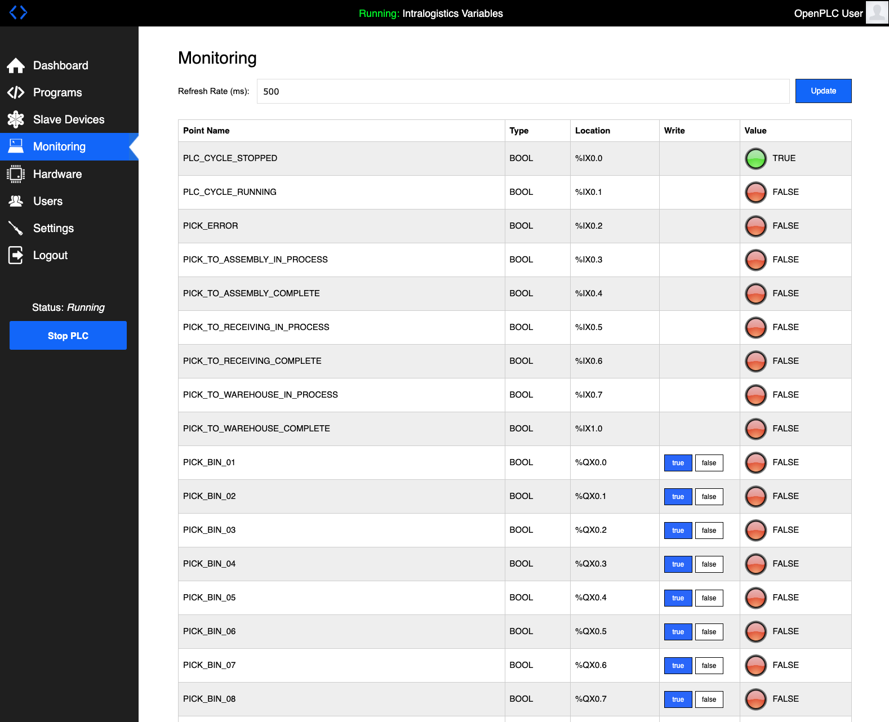
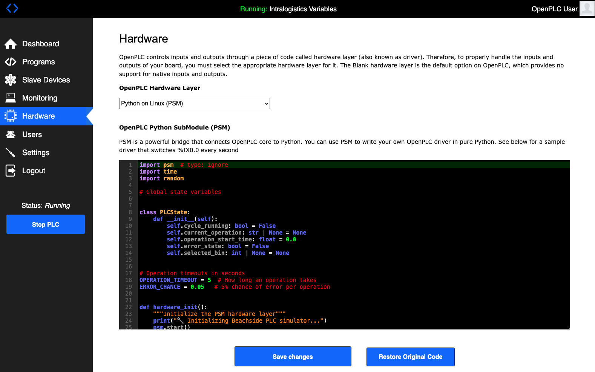

# CODESYS Configuration Guide for Intralogistics Simulator

## Overview

This guide covers the configuration and setup of CODESYS webserver for use with the Intralogistics Simulator, including structured text variable definitions, Python SubModule (PSM) integration, and Modbus connection setup.

## Table of Contents

1. [Initial Setup](#initial-setup)
2. [Structured Text Configuration](#structured-text-configuration)
3. [PSM Hardware Layer](#psm-hardware-layer)
4. [Modbus Connection Setup](#modbus-connection-setup)
5. [Signal Dashboard Configuration](#signal-dashboard-configuration)

## Initial Setup

1. Access the CODESYS webserver interface
2. Navigate to the Programs section
3. Ensure you have the following files ready:
   - Intralogistics Variables structured text file
   - PSM hardware layer script


## Structured Text Configuration

The structured text program defines all PLC variables used by the simulator. Upload the `intralogistics_variables.st` file which contains:

```pascal
PROGRAM prog0
  VAR
    (* Digital Inputs - Read Only *)
    PLC_CYCLE_STOPPED AT %IX0.0 : BOOL;
    PLC_CYCLE_RUNNING AT %IX0.1 : BOOL;
    PICK_ERROR AT %IX0.2 : BOOL;
    // ... other inputs

    (* Digital Outputs for Bin Selection *)
    PICK_BIN_01 AT %QX0.0 : BOOL;
    PICK_BIN_02 AT %QX0.1 : BOOL;
    // ... other bin selections

    (* Station Selection Outputs *)
    TO_RECEIVING_STA_1 AT %QX4.0 : BOOL;
    FROM_RECEIVING AT %QX4.1 : BOOL;
    TO_ASSEMBLY_STA_1 AT %QX4.2 : BOOL;
    FROM_ASSEMBLY AT %QX4.3 : BOOL;
  END_VAR
END_PROGRAM
```

These variable definitions map directly to Modbus addresses and are monitored in the CODESYS interface:



## PSM Hardware Layer

1. Navigate to the Hardware section in CODESYS
2. Select "Python on Linux (PSM)" from the hardware layer dropdown
3. Configure the PSM script that handles I/O operations:



The PSM script provides:

- Real-time I/O handling
- Operation state management
- Error detection
- Signal monitoring

## Modbus Connection Setup

1. Access the EpiBus interface
2. Create a new Modbus Connection with these settings:
   - Device Type: PLC
   - Host: codesys
   - Port: 502


3. Configure the signal mappings:
   - Bin selection signals (Digital Output Coils)
   - Station selection signals (Digital Output Coils)
   - Status signals (Digital Input Contacts)

## Signal Dashboard Configuration

The Modbus Signal Dashboard provides real-time monitoring of all signals:


Key features:

- Filter by device type and signal type
- Real-time value updates
- Signal status indicators
- PLC address mapping display

### Signal Types

- Digital Output Coils (QX): Control signals for bin and station selection
- Digital Input Contacts (IX): Status and feedback signals
- Addresses follow IEC 61131-3 conventions

## Testing the Configuration

1. Start the CODESYS runtime
2. Monitor the signal dashboard for activity
3. Test basic operations:
   - Bin selection
   - Station movement commands
   - Status feedback

Look for the green "Running" indicator in the CODESYS interface to confirm proper operation.

## Troubleshooting

Common issues and solutions:

1. Connection Errors
   
   - Verify codesys hostname resolution
   - Check port 502 accessibility
   - Confirm network configuration

2. Signal Mapping Issues
   
   - Verify address alignment between ST and Modbus
   - Check signal type configuration
   - Confirm proper data types

3. Runtime Errors
   
   - Monitor PSM script logs
   - Check CODESYS error messages
   - Verify hardware layer selection

## Additional Resources

- CODESYS Documentation: [http://www.codesysproject.com/docs](http://www.codesysproject.com/docs)
- EpiBus Documentation: https://github.com/appliedrelevance/epibus 
- Reference Implementation: View the example configuration files in the project repository